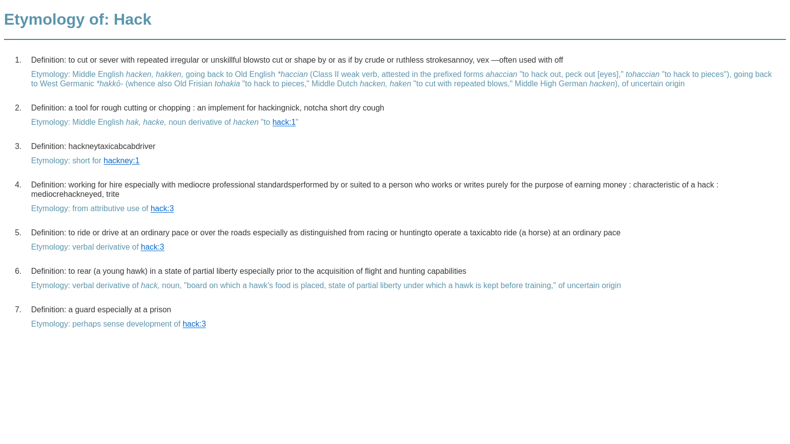
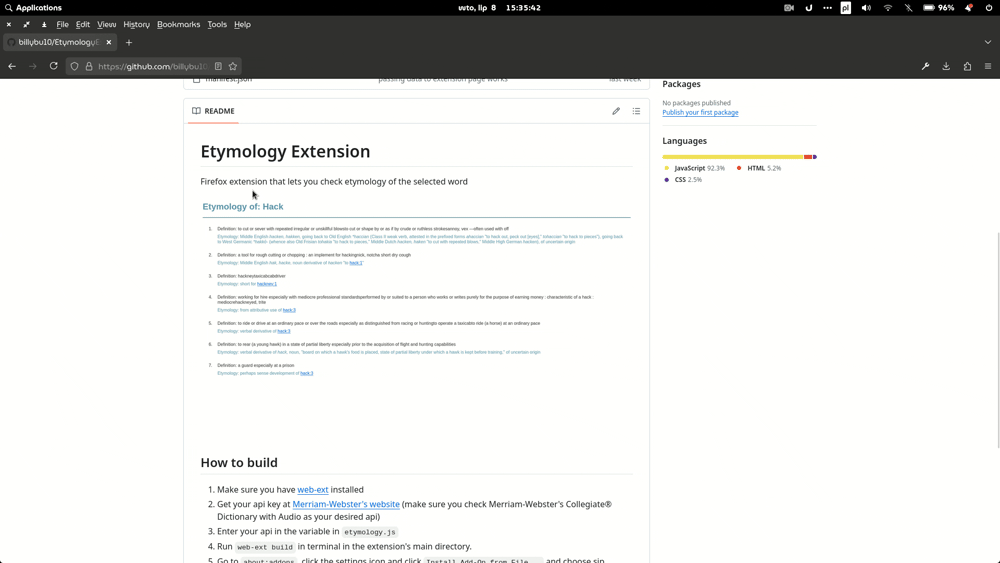

# Etymology Extension
Firefox extension that lets you check etymology of the selected word. Just select the word, right-click, and choose "Check etymology of the selected word" from context menu.





## How to build
1. Make sure you have [web-ext](https://github.com/mozilla/web-ext) installed
2. Get your api key at [Merriam-Webster's website](https://www.dictionaryapi.com/) (make sure you check 
Merriam-Webster's Collegiate® Dictionary with Audio as your desired api)
3. Enter your api in the variable in ```etymology.js```
4. Run ```web-ext build``` in terminal in the extension's main directory.
5. Go to ```about:addons```, click the settings icon and click ```Install Add-On from File...``` and choose sip created in extension's main folder.

## Resources used in this project

- [](https://dictionaryapi.com/products/api-collegiate-dictionary) [Merriam-Webster's Collegiate® Dictionary api](https://dictionaryapi.com/products/api-collegiate-dictionary)
- Icon: [Open Book by Mohamed_hasan](https://pixabay.com/illustrations/open-book-bible-book-icon-2268948/)